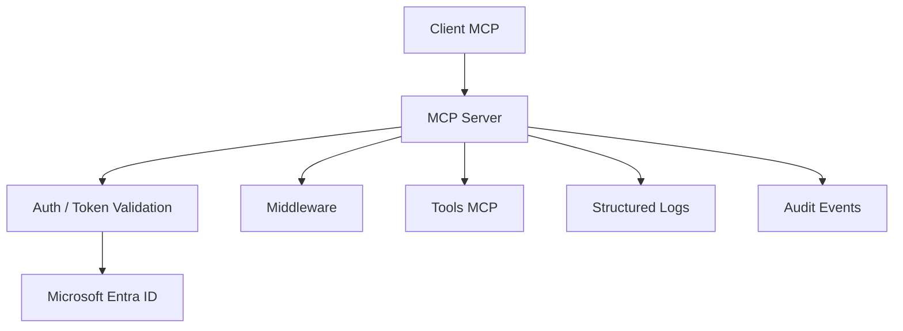
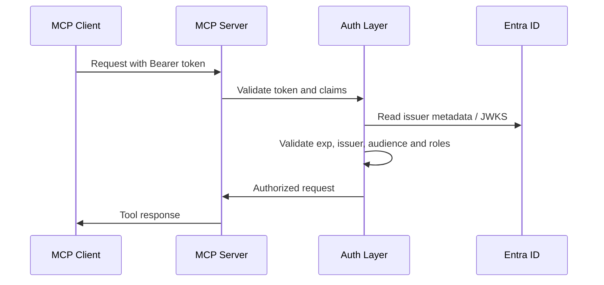

# MCP Server com Autenticacao Microsoft Entra ID

Referencia de servidor MCP com autenticacao corporativa via Microsoft Entra ID, validacao de JWT, middleware de correlacao e auditoria, e registro explicito de tools.

O objetivo deste repositorio e servir como base pratica para novos servidores MCP em ambientes corporativos. O foco esta na arquitetura, no fluxo de autenticacao, na configuracao segura e na reutilizacao do padrao, nao no catalogo de tools.

## Visao geral

Este projeto demonstra como estruturar um MCP Server com:

- autenticacao com Microsoft Entra ID
- validacao de tokens JWT
- controle de acesso por roles
- middleware de correlacao e auditoria
- logs estruturados
- configuracao por variaveis de ambiente
- estrutura pequena, clara e reutilizavel

Ele e util como referencia porque mostra um caminho simples para construir servidores MCP com preocupacoes reais de empresa:

- autenticacao centralizada
- autorizacao explicita
- rastreabilidade por request
- logs auditaveis
- provisionamento Entra repetivel

## Principais recursos

- MCP Server com FastMCP
- autenticacao com Microsoft Entra ID
- suporte a `AUTH_MODE=jwt` e `AUTH_MODE=oauth`
- validacao de JWT e claims
- autorizacao por App Roles
- middleware de correlacao com `request_id`
- auditoria estruturada de chamadas
- logs JSON com `structlog`
- configuracao por variaveis de ambiente
- scripts de provisionamento Entra idempotentes
- estrutura pronta para extensao corporativa

## Arquitetura

O servidor foi organizado para separar claramente:

- boot e startup
- configuracao
- autenticacao e autorizacao
- middleware
- tools
- logging

### Componentes principais

- `src/app/__main__.py`: ponto de entrada do processo
- `src/app/server.py`: composicao do FastMCP, auth e middleware
- `src/app/config.py`: settings e variaveis de ambiente
- `src/app/auth/`: validacao de token e regras de acesso
- `src/app/middleware/`: correlacao e auditoria
- `src/app/tools/`: tools MCP de referencia
- `src/app/logging_config.py`: configuracao global de logging

### Diagrama da arquitetura



### Como a requisicao percorre o servidor

1. O cliente envia uma requisicao MCP com Bearer token.
2. O FastMCP recebe a chamada HTTP.
3. O middleware de correlacao gera o `request_id` e registra contexto.
4. O provider de autenticacao valida o token e as claims.
5. O controle de acesso verifica se a role permite a tool.
6. O middleware de auditoria registra a chamada.
7. A tool executa e a resposta retorna ao cliente.

### Fluxo de autenticacao



## Fluxo de autenticacao

O modelo implementado usa Microsoft Entra ID como autoridade de identidade.

### Modos suportados

- `AUTH_MODE=jwt`
  - o cliente envia o token Bearer direto
  - indicado para portais, automacoes e clientes que ja possuem token
- `AUTH_MODE=oauth`
  - o servidor faz o fluxo OAuth com proxy
  - indicado para clientes interativos que precisam do browser flow

### Como o token e validado

O projeto valida:

- issuer
- audience
- expiracao
- claims do token
- roles permitidas

No modo `jwt`, o verifier rejeita tokens que nao tragam roles permitidas.

### Como a autorizacao funciona

As tools usam App Roles via `auth=require_roles(...)`.

Roles atuais:

- `mcp-trc-read`
- `mcp-trc-admin`

Se o token nao tiver uma dessas roles, a tool nao deve ser exposta nem executada.

### Falhas tratadas

- token ausente
- token invalido
- issuer invalido
- audience invalida
- token expirado
- role ausente
- role nao permitida

## Configuracao de autenticacao

### App Registration

O projeto espera um App Registration no Entra com:

- Application ID / Client ID
- Tenant ID
- scope `access_as_user`
- App Roles `mcp-trc-read` e `mcp-trc-admin`

### Variaveis de ambiente

O arquivo `.env.example` define o contrato minimo esperado:

```env
AZURE_CLIENT_ID=your-app-registration-client-id
AZURE_CLIENT_SECRET=your-client-secret  # only for AUTH_MODE=oauth
AZURE_TENANT_ID=your-tenant-id
MCP_BASE_URL=http://localhost:8000

# auth mode: jwt (default) | oauth
AUTH_MODE=jwt
```

### Variaveis usadas pelo servidor

- `AZURE_TENANT_ID`
- `AZURE_CLIENT_ID`
- `AZURE_CLIENT_SECRET` somente em `AUTH_MODE=oauth`
- `MCP_BASE_URL`
- `AUTH_MODE`
- `TRUST_PROXY_HEADERS`
- `MCP_HOST`
- `MCP_PORT`
- `LOG_LEVEL`

### Como validar o ambiente

O projeto falha cedo se faltar configuracao obrigatoria.

Exemplo de validacao:

```powershell
python -m app
```

Se faltar algo, o startup para com erro de variavel ausente.

## Configuracao do projeto

### Instalacao

```powershell
python -m venv .venv
.venv\Scripts\Activate.ps1
python -m pip install -U pip
python -m pip install -e .[dev]
```

### Execucao local

```powershell
python -m app
```

### Execucao com Docker

```powershell
docker build -t fastmcp-auth-entraid .
docker run --rm -p 8000:8000 `
  -e AUTH_MODE=jwt `
  -e AZURE_TENANT_ID=<tenant-id> `
  -e AZURE_CLIENT_ID=<client-id> `
  -e MCP_BASE_URL=http://localhost:8000 `
  fastmcp-auth-entraid
```

### Estrutura de configuracao

- `src/app/__main__.py`: carrega `.env` e sobe o servidor
- `src/app/config.py`: settings e validacao
- `src/app/logging_config.py`: logging JSON
- `Dockerfile`: imagem de runtime
- `.env.example`: exemplo de configuracao local

## Estrutura de pastas

```text
.
├── src/
│   └── app/
│       ├── __main__.py
│       ├── config.py
│       ├── logging_config.py
│       ├── server.py
│       ├── auth/
│       ├── middleware/
│       └── tools/
├── docs/
│   ├── architecture.md
│   └── adr/
├── scripts/
├── tests/
├── README.md
└── .env.example
```

### Responsabilidade de cada pasta

- `src/app/`: codigo da aplicacao
- `src/app/auth/`: autenticacao e autorizacao
- `src/app/middleware/`: correlacao e auditoria
- `src/app/tools/`: tools MCP de referencia
- `docs/`: arquitetura e ADRs
- `scripts/`: provisionamento Entra
- `tests/`: testes unitarios e integracao

## Logs e auditoria

### O que e logado

- `request_id`
- `client_ip`
- `tool`
- `subject`
- `upn`
- `oid`
- `tid`
- `roles`
- `duration_ms`
- tipo de erro em falhas

### Como identificar o usuario

O audit log registra:

- `subject`
- `upn`
- `oid`
- `tid`

Para leitura humana, `upn` costuma ser o mais util.
Para identificacao estavel, `oid` e mais confiavel.

### O que nao deve ser logado

- tokens
- secrets
- payload bruto
- argumentos de tool
- retornos sensiveis

### Como o projeto evita vazamento

- logging em JSON
- redacao de campos sensiveis
- auditoria sem argumentos de tool
- `request_id` gerado no servidor
- `X-Forwarded-For` confiavel apenas em proxy conhecido

## Seguranca

Cuidados principais:

- validacao de token
- validacao de issuer
- validacao de audience
- validacao de expiracao
- autorizacao por App Roles
- separacao entre auth, authz e execucao
- logs sem secrets
- variaveis de ambiente para configuracao
- `TRUST_PROXY_HEADERS=true` somente em infra confiavel

## Tools MCP

As tools ficam em `src/app/tools/`.

Elas existem neste repositorio como referencia tecnica, nao como foco do produto.

### Como adicionar uma nova tool

1. criar um arquivo novo em `src/app/tools/`
2. definir a tool com `Tool.from_function(...)`
3. adicionar `ToolAnnotations`
4. definir `output_schema`
5. registrar em `src/app/tools/__init__.py`
6. adicionar testes

### Como sao protegidas

Cada tool recebe `auth=require_roles(...)`.

Isso protege a listagem e a execucao da tool conforme as roles do token.

## Como reutilizar este repositorio

Para usar este repo como base de outro projeto corporativo:

- alterar o nome do pacote se quiser um identificador mais especifico
- ajustar `src/app/config.py` para o novo ambiente
- revisar `src/app/auth/verifier.py` para o tenant e claims esperadas
- revisar `src/app/auth/checks.py` para as roles permitidas
- revisar `src/app/tools/` para o catalogo de tools
- revisar `src/app/middleware/` para correlacao e auditoria
- revisar `src/app/logging_config.py` para padrao de logs
- revisar `scripts/Provision-McpEntra.ps1` para o tenant alvo

### Arquivos que devem ser revisados em um novo projeto

- `README.md`
- `.env.example`
- `src/app/config.py`
- `src/app/auth/verifier.py`
- `src/app/auth/checks.py`
- `src/app/server.py`
- `src/app/middleware/audit.py`
- `src/app/middleware/correlation.py`
- `src/app/tools/__init__.py`
- `scripts/Provision-McpEntra.ps1`

## Documentacao complementar

- [`docs/architecture.md`](docs/architecture.md)
- [`docs/adr/index.md`](docs/adr/index.md)
- [`scripts/provisioning.md`](scripts/provisioning.md)

## Testes

```powershell
pytest -q
python -m build
```

## Referencias

- FastMCP: https://gofastmcp.com
- FastMCP Azure integration: https://gofastmcp.com/integrations/azure
- App Roles do Microsoft Entra ID: https://learn.microsoft.com/entra/identity-platform/howto-add-app-roles-in-apps
- Continuous Access Evaluation: https://learn.microsoft.com/entra/identity/conditional-access/concept-continuous-access-evaluation
