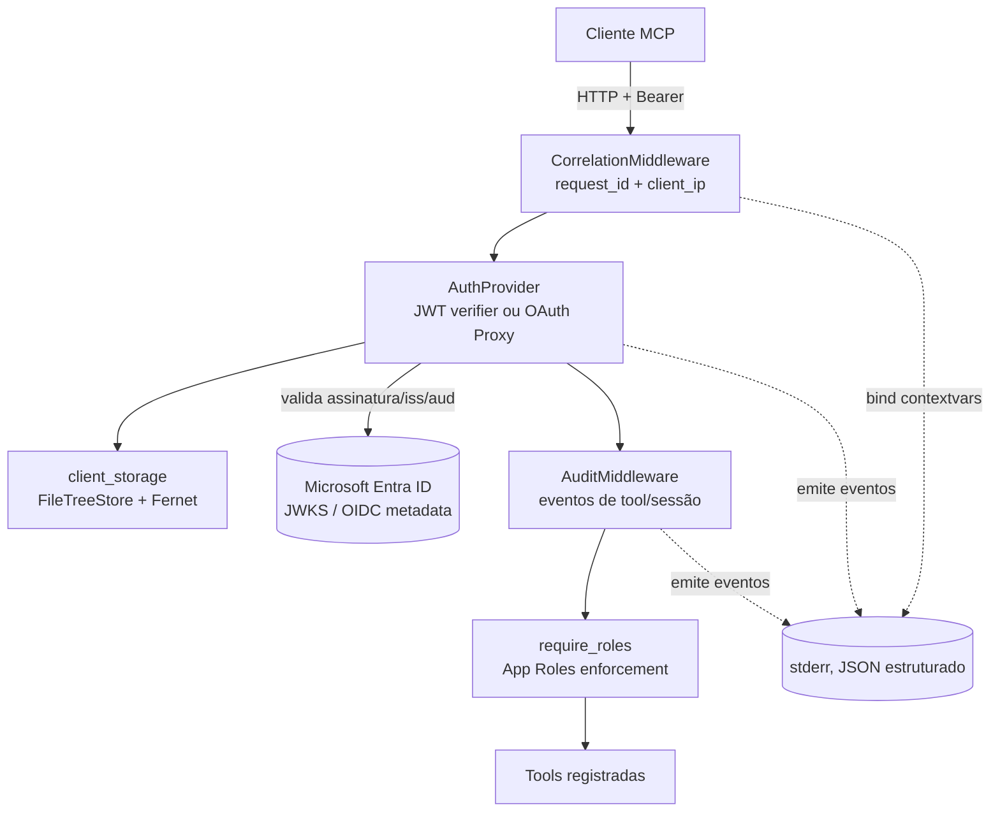
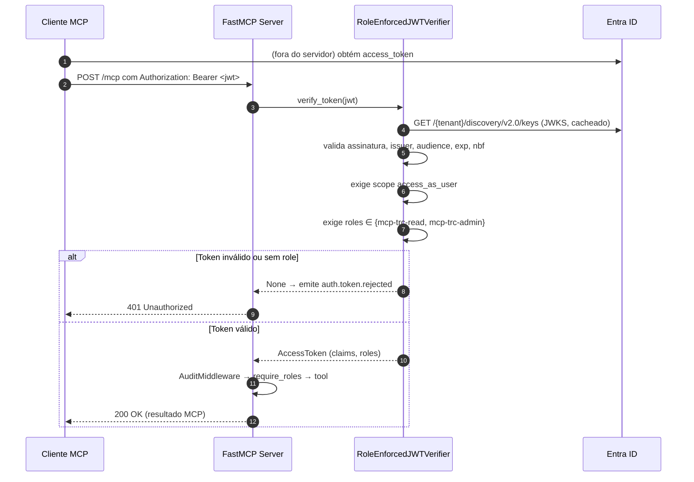
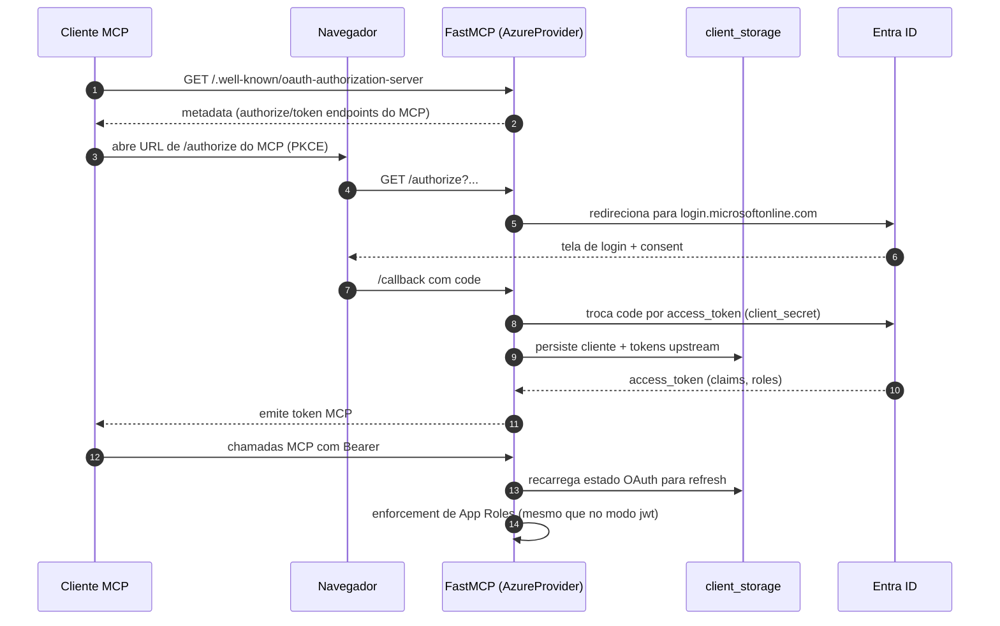

# 🔐 FastMCP + Microsoft Entra ID

Implementação de referência de um servidor [FastMCP](https://gofastmcp.com) com **autenticação Microsoft Entra ID (Azure AD)** em dois modos (JWT direto e OAuth Proxy), validação de JWT contra JWKS, controle de acesso por App Roles, middlewares de correlação e auditoria, e logs estruturados.

O objetivo deste repositório é servir como **base reutilizável** para novos servidores MCP em ambiente corporativo. O código é pequeno e auditável. As tools incluídas (`soma`, `subtracao`, `multiplicacao`, `divisao`) existem apenas para demonstrar o fluxo completo e não são o foco do projeto.

## 📑 Sumário

- [Visão geral](#-visão-geral)
- [Principais recursos](#-principais-recursos)
- [Arquitetura](#-arquitetura)
- [Fluxo de autenticação](#-fluxo-de-autenticação)
- [Configuração do Entra ID](#-configuração-do-entra-id)
- [Configuração do projeto](#%EF%B8%8F-configuração-do-projeto)
- [Estrutura de pastas](#-estrutura-de-pastas)
- [Logs e auditoria](#-logs-e-auditoria)
- [Segurança](#-segurança)
- [Tools MCP](#-tools-mcp)
- [Como reutilizar este projeto](#-como-reutilizar-este-projeto)
- [Testes e build](#-testes-e-build)
- [Execução com Docker](#-execução-com-docker)
- [Documentação complementar](#-documentação-complementar)
- [Referências](#-referências)

---

## 🎯 Visão geral

### O que é

Servidor MCP em Python (FastMCP) que expõe ferramentas (tools) sobre HTTP, com autenticação delegada ao **Microsoft Entra ID** e autorização por **App Roles**. Suporta dois modos de autenticação no mesmo binário:

- 🪪 **`AUTH_MODE=jwt`**: o cliente envia um Bearer token Entra ID e o servidor valida o JWT contra o JWKS público do tenant. Indicado para portais corporativos, automações, Azure Container Apps com Managed Identity e qualquer cliente que já possua um token.
- 🌐 **`AUTH_MODE=oauth`**: o servidor atua como **OAuth Proxy** para clientes interativos. O fluxo de login no navegador é orquestrado pelo próprio FastMCP via `AzureProvider`.

### Problema que resolve

Servidores MCP costumam ser publicados sem qualquer barreira corporativa: tokens locais, escopos genéricos, sem rastreabilidade. Este projeto demonstra como entregar um MCP em produção com:

- ✅ Validação de token via JWKS do Entra ID (issuer, audience, expiração, assinatura).
- 👥 RBAC baseado em **App Roles** atribuídas a **grupos de segurança** e não a usuários individuais.
- 🙈 Filtragem do `tools/list` por token: o LLM nunca enxerga uma tool que o usuário não pode executar.
- 📝 Auditoria estruturada de cada chamada, com identidade do chamador e `request_id`.
- 🛡️ Redaction automático de campos sensíveis nos logs.

---

## ✨ Principais recursos

| Recurso | Onde está implementado |
|---|---|
| 🪪 Validação de JWT do Entra ID (issuer, audience, exp, assinatura via JWKS) | `src/app/auth/verifier.py` `RoleEnforcedJWTVerifier` |
| 🌐 OAuth Proxy (login navegador, PKCE) para clientes interativos | `src/app/auth/verifier.py` `AzureProvider` |
| 🛂 Controle de acesso por App Roles | `src/app/auth/checks.py` `require_roles(...)` |
| 🔗 Correlação por `request_id` (sempre gerado no servidor) | `src/app/middleware/correlation.py` |
| 📝 Auditoria estruturada de chamadas e ciclo de vida | `src/app/middleware/audit.py` |
| 🧾 Logs JSON com redaction de campos sensíveis | `src/app/logging_config.py` |
| ⚙️ Configuração 100% via variáveis de ambiente | `src/app/config.py` |
| 🧭 Registro explícito de tools (sem auto-discovery) | `src/app/tools/__init__.py` |
| 🛠️ Provisionamento idempotente do Entra ID via PowerShell | `scripts/Provision-McpEntra.ps1`, `scripts/modules/McpEntra.psm1` |
| 🐳 Imagem Docker multi-stage com usuário não-root | `Dockerfile` |

---

## 🏗️ Arquitetura

O servidor é um ASGI app criado em `src/app/server.py`. Cada requisição HTTP percorre uma cadeia bem definida: middleware de correlação → autenticação Entra ID → middleware de auditoria → execução da tool.



### Componentes

- 🚀 **`server.py`**: fábrica `create_mcp()` monta a instância `FastMCP` com o provider de auth e o middleware de auditoria. `create_http_app()` envolve em ASGI e adiciona o middleware de correlação.
- ⚙️ **`config.py`**: `Settings` imutável carregado de variáveis de ambiente. `ALLOWED_ROLES` é o conjunto autorizativo (`mcp-trc-read`, `mcp-trc-admin`).
- 🔐 **`auth/`**: `build_auth_provider()` decide entre `RemoteAuthProvider + RoleEnforcedJWTVerifier` (modo `jwt`) e `AzureProvider` (modo `oauth`). `require_roles()` é o `AuthCheck` aplicado por tool.
- 🔗 **`middleware/correlation.py`**: gera `request_id`, ignora qualquer `X-Request-ID` de entrada, propaga via `structlog.contextvars` e devolve no header de resposta.
- 📝 **`middleware/audit.py`**: emite `mcp.client.connected`, `mcp.tool.call.start/success/error` com identidade do chamador e duração.
- 🧰 **`tools/`**: cada tool em um arquivo. Registro centralizado em `__init__.py:register_tools()`.
- 🧾 **`logging_config.py`**: configura `structlog` com JSONRenderer, timestamp ISO UTC e redaction de chaves sensíveis.
- 🎬 **`__main__.py`**: entrypoint. Carrega `.env`, configura logging e sobe `uvicorn`.

### Como a requisição percorre o servidor

1. O cliente envia uma requisição MCP com Bearer token.
2. O FastMCP recebe a chamada HTTP.
3. O middleware de correlação gera o `request_id` e registra contexto.
4. O provider de autenticação valida o token e as claims.
5. O controle de acesso verifica se a role permite a tool.
6. O middleware de auditoria registra a chamada.
7. A tool executa e a resposta retorna ao cliente.

### Onde cada coisa acontece

| Etapa | Componente |
|---|---|
| Cliente envia `Authorization: Bearer <jwt>` | (origem externa) |
| Geração de `request_id`, bind no contexto de log | `CorrelationMiddleware` |
| Download/cache de JWKS, validação de assinatura, issuer, audience, expiração | `RoleEnforcedJWTVerifier` (herda `AzureJWTVerifier`) |
| Rejeição de tokens sem App Role autorizada (`auth.token.rejected`) | `RoleEnforcedJWTVerifier.verify_token` |
| Filtragem do `tools/list` por token e enforcement em `tools/call` | `Tool(auth=require_roles(...))` |
| Auditoria da chamada (start/success/error + duração) | `AuditMiddleware.on_call_tool` |
| Execução da função Python da tool | `src/app/tools/<nome>.py` |
| Resposta HTTP com header `X-Request-ID` | `CorrelationMiddleware` |

---

## 🔑 Fluxo de autenticação

### Modo `jwt` (recomendado para automações e portais)

O cliente é responsável por obter o token (via MSAL, Managed Identity, On-Behalf-Of, etc.) e enviá-lo no header `Authorization: Bearer <token>`.



**🔎 Claims verificadas**

| Claim | Verificação |
|---|---|
| `iss` | `https://login.microsoftonline.com/{AZURE_TENANT_ID}/v2.0` |
| `aud` | `api://{AZURE_CLIENT_ID}` (token v2) |
| `exp`, `nbf` | Janela de tempo válida |
| Assinatura | Chave pública JWKS do tenant |
| `scp` | Inclui `access_as_user` |
| `roles` | Interseção não vazia com `{mcp-trc-read, mcp-trc-admin}` |

### Modo `oauth`

O servidor expõe os endpoints OAuth (`/authorize`, `/token`, `/.well-known/...`) e age como proxy para o Entra ID. O cliente MCP descobre o servidor de autorização e dispara o fluxo no navegador.



Esse modo exige `AZURE_CLIENT_SECRET` configurado. Para produção, mantenha o secret no **Azure Key Vault** e injete via Managed Identity.

### ⚠️ Falhas tratadas

| Situação | Comportamento | Evento de log |
|---|---|---|
| Token ausente | Request falha 401 | (sem evento) |
| JWT mal formado, assinatura inválida ou expirado | `verify_token` retorna `None`, request falha 401 | `auth.token.invalid` |
| Issuer ou audience inválidos | `verify_token` retorna `None`, request falha 401 | `auth.token.invalid` |
| JWT válido sem App Role permitida | `verify_token` retorna `None`, request falha 401 | `auth.token.rejected` (com `subject`, `token_roles`) |
| JWT válido com pelo menos uma role permitida | Prossegue | `auth.token.accepted` (com `subject`, `granted_roles`) |
| Chamada de tool com role insuficiente | `tools/list` oculta a tool, `tools/call` retorna erro de autorização | (sem evento dedicado) |
| `AUTH_MODE=oauth` sem `AZURE_CLIENT_SECRET`, `FASTMCP_JWT_SIGNING_KEY` ou `MCP_OAUTH_STORAGE_ENCRYPTION_KEY` | Startup falha com `ValueError` | (sem evento, falha de boot) |

---

## ☁️ Configuração do Entra ID

O provisionamento completo é automatizado em [`scripts/Provision-McpEntra.ps1`](scripts/Provision-McpEntra.ps1). O detalhamento operacional está em [`scripts/provisioning.md`](scripts/provisioning.md). Esta seção resume o que é criado e por quê.

### 📦 Recursos provisionados

1. 🏷️ **App Registration**: `signInAudience=AzureADMyOrg`, identifier URI `api://<client-id>`, `requestedAccessTokenVersion=2` (rejeita tokens v1).
2. 🎟️ **OAuth scope** `access_as_user`: delegado, consentido pelo usuário. Não carrega autorização por si só, é o gate para emissão de token.
3. 👥 **App Roles** `mcp-trc-read` e `mcp-trc-admin`: atribuíveis a `User` e `Application` (para Managed Identity / OBO). Esses nomes também são os valores em `claims.roles`.
4. 🧱 **Service Principal**: habilita sign-ins para a App Registration.
5. 🔑 **Client Secret** (opcional, `-SkipClientSecret` para pular): obrigatório só em `AUTH_MODE=oauth`.
6. ✅ **Admin Consent**: `AllPrincipals` para `access_as_user` (requer Privileged Role Administrator).
7. 👨‍👩‍👧 **Security Groups** `mcp-trc-read`, `mcp-trc-admin`: atribuídos às App Roles correspondentes.

### 🚀 Quick start

```powershell
az login --tenant <TENANT_ID>
./scripts/Provision-McpEntra.ps1 -TenantId <TENANT_ID> -OutEnvFile .env
```

O script grava um bloco `.env` com `AZURE_TENANT_ID`, `AZURE_CLIENT_ID`, `AZURE_CLIENT_SECRET` (se gerado) e `MCP_BASE_URL`. Trate esse arquivo como secret.

### ➕ Acesso de um novo usuário

Atribuir uma role a um usuário equivale a adicionar o usuário ao grupo correspondente:

```powershell
$USER_OID = az ad user show --id user@example.com --query id -o tsv
az ad group member add --group <object-id-do-grupo-mcp-trc-read> --member-id $USER_OID
```

O efeito é visível **no próximo token emitido** (~1 hora por padrão). Para revogação imediata, habilite [Continuous Access Evaluation](https://learn.microsoft.com/entra/identity/conditional-access/concept-continuous-access-evaluation).

---

## 🛠️ Configuração do projeto

### 🔧 Variáveis de ambiente

| Variável | Obrigatória | Default | Descrição |
|---|---|---|---|
| `AZURE_TENANT_ID` | sim | (vazio) | Tenant ID do Entra ID. |
| `AZURE_CLIENT_ID` | sim | (vazio) | Application (client) ID da App Registration. |
| `AZURE_CLIENT_SECRET` | só em `AUTH_MODE=oauth` | (vazio) | Client secret. Em produção, leia do Key Vault. |
| `AUTH_MODE` | não | `jwt` | `jwt` ou `oauth`. |
| `MCP_BASE_URL` | não | `http://localhost:8000` | URL pública do servidor (usada na descoberta OAuth). |
| `FASTMCP_JWT_SIGNING_KEY` | só em `AUTH_MODE=oauth` | (vazio) | Chave estável usada para assinar os JWTs emitidos pelo FastMCP. |
| `MCP_OAUTH_STORAGE_DIR` | não | diretório de dados do usuário | Pasta persistente para o `client_storage` do OAuth Proxy. |
| `MCP_OAUTH_STORAGE_ENCRYPTION_KEY` | só em `AUTH_MODE=oauth` | (vazio) | Chave Fernet usada para criptografar o estado OAuth em disco. |
| `TRUST_PROXY_HEADERS` | não | `false` | Quando `true`, lê `X-Forwarded-For` para `client_ip`. Habilite apenas atrás de proxy confiável. |
| `LOG_LEVEL` | não | `INFO` | `DEBUG`, `INFO`, `WARNING`, `ERROR`, `CRITICAL`. |
| `MCP_HOST` | não | `0.0.0.0` | Bind address do uvicorn. |
| `MCP_PORT` | não | `8000` | Porta do uvicorn. |

Veja [`.env.example`](.env.example). O servidor falha cedo se faltar variável obrigatória.

### 💻 Instalação local

```powershell
python -m venv .venv
.venv\Scripts\Activate.ps1
python -m pip install -U pip
python -m pip install -e ".[dev]"
```

### ▶️ Subir o servidor

```powershell
python -m app
```

O entrypoint (`src/app/__main__.py`) carrega `.env` da CWD, configura logging e inicia `uvicorn`. O servidor responde em `http://localhost:8000/mcp/` (rota padrão do FastMCP HTTP transport).

No modo `oauth`, o servidor usa `client_storage` persistente para manter o estado do OAuth Proxy e conseguir renovar tokens sem novo login manual. Em produção single-instance, `MCP_OAUTH_STORAGE_DIR` deve apontar para um volume persistente.

### 🧪 Validar autenticação

Sem token, deve retornar 401:

```powershell
curl -i http://localhost:8000/mcp/
```

Com token válido (substitua `<JWT>`):

```powershell
curl -s -H "Authorization: Bearer <JWT>" http://localhost:8000/mcp/tools/list
```

Os eventos correspondentes (`auth.token.accepted`, `mcp.client.connected`) aparecem em stderr no formato JSON.

---

## 📂 Estrutura de pastas

```text
.
├── src/app/
│   ├── __main__.py          # entrypoint: load_dotenv, configure_logging, uvicorn.run
│   ├── server.py            # create_mcp / create_http_app
│   ├── config.py            # Settings, ALLOWED_ROLES, load_settings()
│   ├── logging_config.py    # structlog JSON + redaction de campos sensíveis
│   ├── auth/
│   │   ├── verifier.py      # RoleEnforcedJWTVerifier + build_auth_provider
│   │   ├── checks.py        # require_roles(...) AuthCheck por tool
│   │   └── oauth_storage.py  # client_storage persistente do OAuth
│   ├── middleware/
│   │   ├── correlation.py   # request_id + client_ip via contextvars
│   │   └── audit.py         # eventos de sessão e tool calls
│   └── tools/
│       ├── __init__.py      # register_tools(mcp) registro explícito
│       ├── soma.py
│       ├── subtracao.py
│       ├── multiplicacao.py
│       └── divisao.py
├── tests/
│   ├── unit/                # config, verifier, middleware, logging, tools
│   └── integration/         # factory + wiring
├── scripts/
│   ├── Provision-McpEntra.ps1
│   ├── Remove-McpEntra.ps1
│   ├── modules/McpEntra.psm1
│   └── provisioning.md
├── docs/
│   ├── architecture.md
│   └── adr/                 # decisões arquiteturais (0001..0005)
├── Dockerfile
├── pyproject.toml
├── requirements.txt
├── .env.example
└── README.md
```

| Diretório | Responsabilidade |
|---|---|
| `src/app/auth/` | Tudo relacionado à validação de token e autorização por App Roles. |
| `src/app/middleware/` | Correlação e auditoria. Nada de negócio. |
| `src/app/tools/` | Definição e registro de tools. **Único lugar para adicionar nova tool.** |
| `scripts/` | Provisionamento Entra ID (PowerShell idempotente). |
| `docs/adr/` | Registro imutável de decisões arquiteturais. |
| `tests/unit/` | Testes isolados por módulo. |
| `tests/integration/` | Wiring do app completo (factory + middleware). |

---

## 📝 Logs e auditoria

### 🔧 Pipeline de logs

`logging_config.configure_logging()` configura `structlog` com:

- 🧾 Saída **JSON em stderr** (`structlog.processors.JSONRenderer`).
- 🕒 Timestamp **ISO 8601 UTC**.
- 🛡️ **Redaction automática** de chaves sensíveis (`authorization`, `access_token`, `client_secret`, `id_token`, `password`, `refresh_token`, `secret`, `token`), substituídas por `[REDACTED]`.
- 🔌 **Bridge stdlib**: logs de `uvicorn`, `fastmcp` e bibliotecas terceiras também saem em JSON.
- 🧵 `request_id` e `client_ip` via `contextvars`; `client_session` vem do `session_id` do contexto MCP em cada request.

### 📡 Eventos emitidos

| Evento | Quando | Campos relevantes |
|---|---|---|
| `auth.token.invalid` | JWT mal formado, assinatura/expiração inválidas | (mensagem básica) |
| `auth.token.rejected` | JWT válido sem App Role permitida | `subject`, `token_roles`, `reason` |
| `auth.token.accepted` | JWT válido com role permitida | `subject`, `granted_roles` |
| `mcp.client.connected` | Início de sessão MCP | `subject`, `upn`, `oid`, `tid`, `roles`, `client_session` |
| `mcp.tool.call.start` | Início da execução de uma tool | `tool`, `roles`, identidade |
| `mcp.tool.call.success` | Tool retornou com sucesso | `tool`, `duration_ms`, identidade |
| `mcp.tool.call.error` | Tool levantou exceção | `tool`, `error_type`, `duration_ms` |

### 👤 Como identificar o usuário

Cada evento de auditoria inclui:

- `subject`: identificador do principal (`sub` ou `oid`).
- `upn`: User Principal Name (formato humano, útil para leitura rápida).
- `oid`: Object ID (estável, recomendado para correlação confiável).
- `tid`: Tenant ID.

Para identificação estável entre rotações de `upn`, prefira `oid`.

### 🚫 O que **não** é logado

- Argumentos das tools.
- Valores retornados pelas tools.
- Tokens (Bearer ou refresh).
- Client secret.
- Qualquer chave da lista de campos sensíveis.

A ausência desses dados é validada por testes em `tests/unit/test_audit_middleware.py` e `tests/unit/test_verifier_logging.py`.

### 🔗 Correlação

- `request_id` é **sempre** gerado pelo servidor (UUID v4). Um `X-Request-ID` enviado pelo cliente é ignorado.
- O id é devolvido no header `X-Request-ID` da resposta.
- Todo log emitido durante a request carrega `request_id` automaticamente.
- `client_ip` vem do `scope.client` por padrão. Só lê `X-Forwarded-For` quando `TRUST_PROXY_HEADERS=true`.

---

## 🛡️ Segurança

### ✅ Controles implementados

- 🔍 **Validação completa de JWT**: assinatura via JWKS do tenant, issuer (`https://login.microsoftonline.com/{tenant}/v2.0`), audience (`api://{client_id}`), expiração, `nbf`.
- 🆕 **Token v2 obrigatório**: `requestedAccessTokenVersion=2` na App Registration. Tokens v1 são rejeitados.
- 👥 **App Roles em vez de scopes**: autorização exige claim `roles` com interseção em `{mcp-trc-read, mcp-trc-admin}`. Usuários não podem se auto-conceder.
- 🙈 **Filtragem de `tools/list`**: o LLM nunca enxerga uma tool fora do seu role set, eliminando uma classe de prompt-injection.
- 🔁 **Enforcement duplo**: `tools/list` filtra, `tools/call` re-valida via `require_roles`.
- 🔒 **Segredos por variável de ambiente**: nada hardcoded. Produção usa Key Vault + Managed Identity.
- 👷 **Container não-root**: UID/GID 10001 no `Dockerfile`.
- 🧹 **Sanitização de logs**: campos sensíveis substituídos por `[REDACTED]` antes do `JSONRenderer`.
- 🆔 **`X-Request-ID` server-side**: cliente não consegue forjar correlação.
- 🚦 **`X-Forwarded-For` opt-in**: `TRUST_PROXY_HEADERS=false` por padrão.

### 💡 Boas práticas operacionais

- 👨‍👩‍👧 Atribua App Roles a **grupos de segurança**, não a usuários individuais.
- ⏱️ Em produção, habilite **Continuous Access Evaluation** para revogação imediata.
- 🔐 Mantenha `AZURE_CLIENT_SECRET` no Key Vault e rotacione com frequência.
- 🚫 Não comite `.env` (já no `.gitignore`).
- 📊 Reveja os eventos `auth.token.rejected` no Log Analytics. Picos podem indicar tentativas de acesso indevido.
- 📦 Atualize as dependências do `requirements.txt` regularmente. `pip-audit` está disponível em `[lint]`.

Reportar vulnerabilidades: ver [`SECURITY.md`](SECURITY.md).

---

## 🧰 Tools MCP

As quatro tools incluídas (`soma`, `subtracao`, `multiplicacao`, `divisao`) existem como **referência técnica**, não como foco do produto. Seguem o **mesmo template** para servir de exemplo replicável. Cada uma:

- mora em um arquivo próprio em `src/app/tools/`,
- expõe entrada simples com tipos primitivos,
- define `ToolAnnotations` e `output_schema` explícitos,
- aplica `auth=require_roles("mcp-trc-read", "mcp-trc-admin")`.

O registro é **explícito** em `src/app/tools/__init__.py`:

```python
from fastmcp import FastMCP
from .divisao import divisao
from .multiplicacao import multiplicacao
from .soma import soma
from .subtracao import subtracao


def register_tools(mcp: FastMCP) -> None:
    mcp.add_tool(soma)
    mcp.add_tool(subtracao)
    mcp.add_tool(multiplicacao)
    mcp.add_tool(divisao)
```

### 🛡️ Como as tools são protegidas

Cada tool recebe `auth=require_roles(...)`. Isso protege tanto a **listagem** quanto a **execução**: o `tools/list` é filtrado por token e o `tools/call` re-valida no momento da chamada.

### ➕ Adicionar uma nova tool

1. Crie `src/app/tools/<nome>.py` copiando a estrutura de `soma.py`.
2. Defina `Tool.from_function(...)` com `name`, `title`, `description`, `annotations`, `output_schema` e `auth=require_roles(...)`.
3. Importe a tool em `src/app/tools/__init__.py` e adicione `mcp.add_tool(<nome>)` em `register_tools`.
4. Cubra com teste em `tests/unit/test_arithmetic_tools.py` (mesmo padrão) e atualize `tests/unit/test_tool_registration.py` se necessário.

---

## ♻️ Como reutilizar este projeto

Para começar um novo servidor MCP corporativo a partir deste repositório:

| Quero alterar... | Edite... |
|---|---|
| Nome do projeto, dependências, metadata | `pyproject.toml`, `README.md` |
| App Roles permitidas | `ALLOWED_ROLES` em `src/app/config.py` e os nomes em `scripts/Provision-McpEntra.ps1` |
| Tenant/App padrão para dev | `.env` (nunca comite) |
| Tools expostas | substitua os arquivos em `src/app/tools/` e atualize `register_tools` |
| Eventos de auditoria adicionais | `src/app/middleware/audit.py` |
| Campos sensíveis a redigir | `_SENSITIVE_KEYS` em `src/app/logging_config.py` |
| Middleware adicional (rate limit, CSP, etc.) | adicione em `create_http_app` em `src/app/server.py` |
| Modo OAuth scopes específicos | `required_scopes` / `additional_authorize_scopes` em `src/app/auth/verifier.py` |
| Provisionamento Entra ID | `scripts/modules/McpEntra.psm1` (helpers) e `scripts/Provision-McpEntra.ps1` |

### 📋 Arquivos que **sempre** devem ser revisados num novo fork

- `README.md`
- `.env.example`
- `pyproject.toml` (nome, descrição, URLs)
- `src/app/config.py` (`ALLOWED_ROLES` precisa refletir as roles do seu domínio)
- `src/app/auth/verifier.py` (tenant e claims esperadas)
- `src/app/auth/checks.py` (roles permitidas)
- `src/app/server.py` (composição de middlewares)
- `src/app/middleware/audit.py` (eventos do domínio)
- `src/app/middleware/correlation.py` (política de proxy)
- `src/app/tools/__init__.py` (catálogo de tools)
- `scripts/Provision-McpEntra.ps1` (defaults de display name e grupos)
- `SECURITY.md` (canal de report)

---

## ✅ Testes e build

```powershell
pytest -q
ruff check .
mypy
python -m build
```

A suite cobre `Settings`, `RoleEnforcedJWTVerifier` (aceitação, rejeição, logging sem vazamento), `AuditMiddleware`, `CorrelationMiddleware`, configuração de logs e a fábrica HTTP.

---

## 🐳 Execução com Docker

```powershell
docker build -t fastmcp-auth-entraid .
docker run --rm -p 8000:8000 `
  -e AUTH_MODE=jwt `
  -e AZURE_TENANT_ID=<tenant-id> `
  -e AZURE_CLIENT_ID=<client-id> `
  -e MCP_BASE_URL=http://localhost:8000 `
  fastmcp-auth-entraid
```

O `Dockerfile` é multi-stage (build venv até runtime slim), executa como usuário não-root (UID 10001) e expõe a porta 8000.

### OAuth com volume persistente

```powershell
docker run --rm -p 8000:8000 `
  -e AUTH_MODE=oauth `
  -e AZURE_TENANT_ID=<tenant-id> `
  -e AZURE_CLIENT_ID=<client-id> `
  -e AZURE_CLIENT_SECRET=<client-secret> `
  -e FASTMCP_JWT_SIGNING_KEY=<stable-jwt-signing-key> `
  -e MCP_OAUTH_STORAGE_ENCRYPTION_KEY=<fernet-key> `
  -e MCP_BASE_URL=https://<public-host> `
  -e MCP_OAUTH_STORAGE_DIR=/data/oauth `
  -v fastmcp-oauth-data:/data `
  fastmcp-auth-entraid
```

Se o volume `/data` não persistir, o proxy perde o estado e pode pedir novo login.

### ☁️ Azure Container Apps

Recomendado para produção:

- `AUTH_MODE=jwt` quando o cliente já obtém o token (portais, automações, OBO).
- `AZURE_CLIENT_SECRET` (se `AUTH_MODE=oauth`) lido do Key Vault via Managed Identity.
- `MCP_BASE_URL` igual à URL pública do app (`https://<app>.azurecontainerapps.io`).
- `TRUST_PROXY_HEADERS=true` somente quando o ingress for confiável.

---

## 📚 Documentação complementar

- [`docs/architecture.md`](docs/architecture.md): princípios arquiteturais, fronteiras de confiança e checklist para novos projetos.
- [`docs/adr/`](docs/adr/): registros de decisão (ADR-0001 a ADR-0005).
- [`scripts/provisioning.md`](scripts/provisioning.md): uso detalhado dos scripts PowerShell de provisionamento.
- [`SECURITY.md`](SECURITY.md): política de divulgação coordenada.

---

## 🔗 Referências

- [FastMCP](https://gofastmcp.com)
- [FastMCP, Azure integration](https://gofastmcp.com/integrations/azure)
- [App Roles no Microsoft Entra ID](https://learn.microsoft.com/pt-br/entra/identity-platform/howto-add-app-roles-in-apps)
- [Continuous Access Evaluation](https://learn.microsoft.com/pt-br/entra/identity/conditional-access/concept-continuous-access-evaluation)
- [Model Context Protocol, spec](https://modelcontextprotocol.io)
