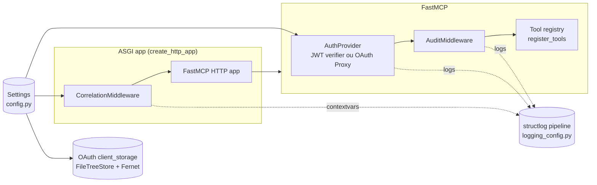
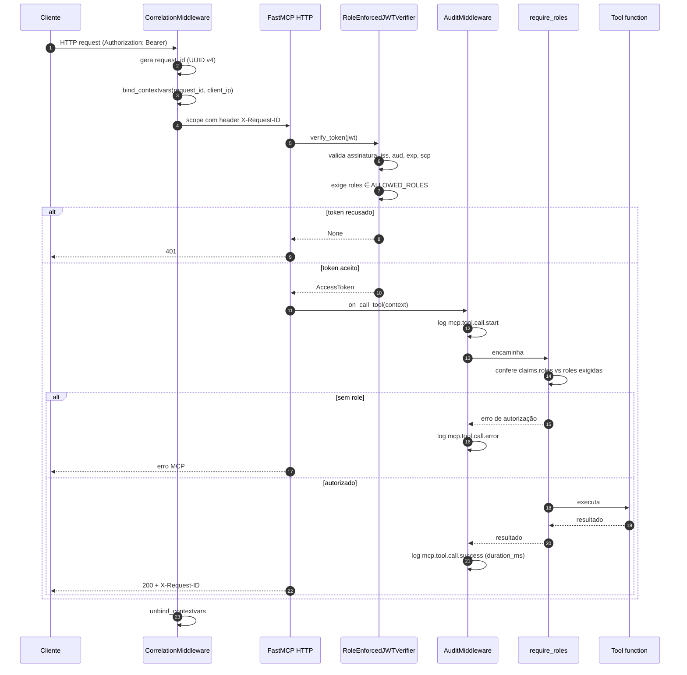

# Arquitetura

Documento técnico complementar ao [`README.md`](../README.md). O README cobre **o que** existe e **como usar**. Este arquivo cobre **por que** o código está estruturado dessa forma, os **limites de confiança** e o **ciclo de vida** detalhado de uma requisição.

Para o histórico de decisões individuais, ver [`adr/`](adr/).

## Princípios

- **Previsibilidade acima de conveniência**: registro explícito de tools, sem auto-discovery em produção.
- **Segurança por padrão**: modo `jwt` é o default, secrets nunca vão para stdout, `TRUST_PROXY_HEADERS=false`.
- **Fronteiras operacionais claras**: `auth`, `middleware`, `tools` e `config` são pacotes independentes. Um deles pode ser substituído sem mexer nos outros.
- **Falhar cedo**: `Settings` valida no boot. Ausência de variável obrigatória aborta o processo.
- **Logs de auditoria, não de depuração**: eventos têm nome estável (`auth.token.rejected`, `mcp.tool.call.success`) e nunca incluem payloads.
- **Estado OAuth persistente**: no modo `oauth`, o `client_storage` deve ficar em volume durável para manter a sessão entre reinícios.

## Diagrama de componentes

## Ciclo de vida de uma requisição (modo `jwt`)

## Fronteiras de confiança

| Fronteira | Lado não confiável | Lado confiável | Controle |
|---|---|---|---|
| Header `Authorization` | Cliente | Servidor | Verificação criptográfica de JWT contra JWKS do Entra ID. |
| Header `X-Request-ID` | Cliente | Servidor | Ignorado. Servidor sempre gera o próprio. |
| Header `X-Forwarded-For` | Proxy upstream | Servidor | Lido apenas quando `TRUST_PROXY_HEADERS=true`. |
| Claims do JWT | Entra ID | Servidor | Aceitas após validação completa. `roles` precisa intersectar `ALLOWED_ROLES`. |
| Argumentos das tools | Cliente | Servidor | Não logados. Validação de tipos no schema da tool. |
| Variáveis de ambiente | Operador | Processo | `Settings` valida formato e presença. Secrets jamais logados. |

## Decisões registradas

Os ADRs em [`adr/`](adr/) cobrem:

- [ADR-0001](adr/0001-dual-auth-modes-jwt-and-oauth-proxy.md): por que dois modos de autenticação no mesmo binário.
- [ADR-0002](adr/0002-app-roles-over-oauth-scopes.md): por que App Roles em vez de OAuth scopes.
- [ADR-0003](adr/0003-structlog-for-observability.md): por que `structlog` com saída JSON.
- [ADR-0004](adr/0004-powershell-for-entra-provisioning.md): por que PowerShell em vez de Terraform/Bicep.
- [ADR-0005](adr/0005-reference-server-with-explicit-tool-registration.md): por que registro explícito de tools.

## Quando deviar deste reference

Deviações são esperadas. Documente-as como novos ADRs. Casos típicos:

- Cliente não consegue obter Bearer token: considerar `AUTH_MODE=oauth`.
- Plataforma exige health probe próprio: adicionar endpoint dedicado (não como tool MCP).
- Tool genuinamente precisa ser descoberta dinamicamente: ADR com justificativa e plano de mitigação.
- Política de logs exige integração com agente OpenTelemetry: adicionar exporter no pipeline existente.

## Checklist para um novo servidor MCP baseado neste reference

1. `pyproject.toml`: ajustar nome, descrição, URLs.
2. `src/app/config.py`: redefinir `ALLOWED_ROLES` para o domínio do projeto.
3. `scripts/Provision-McpEntra.ps1`: ajustar defaults de display name e grupos.
4. Substituir tools de aritmética por tools reais. Manter o template (`auth=`, `output_schema`, `ToolAnnotations`).
5. Revisar `_SENSITIVE_KEYS` em `logging_config.py` se o domínio tem novos nomes de campo sensível.
6. Adicionar middlewares específicos do projeto em `create_http_app` (rate limit, CSP, etc.).
7. Atualizar `SECURITY.md` com canais corretos de report.
8. Adicionar ADRs para qualquer escolha não trivial que divirja deste reference.
